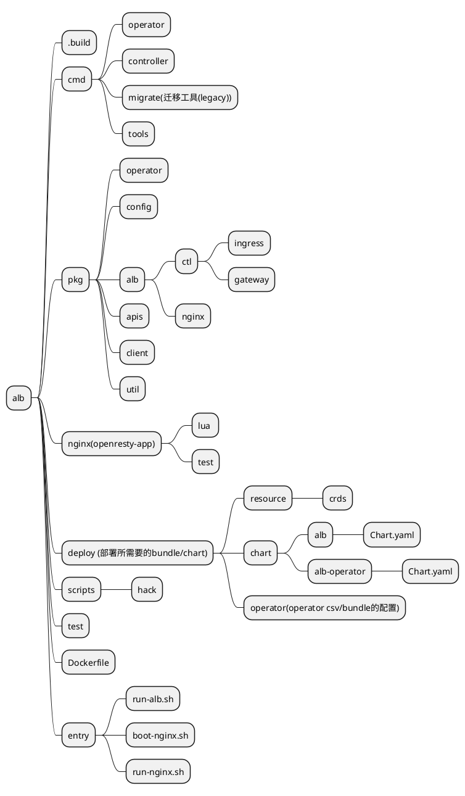
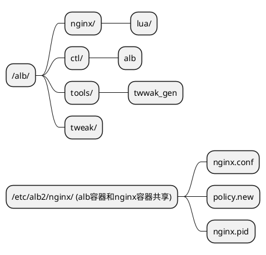

## what it is
ALB (Alauda Load Balancer). a load balancer base on openresty which run in k8s. sometimes we use the same term alb2.
## project struct

## image file struct

## lint 
follow by ./scripts/alb-lint-actions.sh
## git repo 
https://gitlab-ce.alauda.cn/container-platform/alb2
## ci
http://confluence.alauda.cn/pages/viewpage.action?pageId=94878636
## doc
http://confluence.alauda.cn/label/cp/alb-doc
### labels of alb in confluence
alb-doc: all document that related to alb.