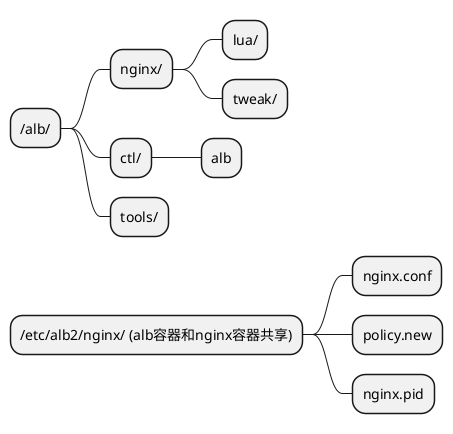

## what it is
ALB (Alauda Load Balancer). a load balancer base on openresty which run in k8s. sometimes we use the same term alb2.
## project struct
./run.sh:   alb image entry point.  
./main.go: entry point  
./alb: use this package to split Init and Start logic from main package  

./controller: generate nginx.config and policy.json relevent.  
./driver ./modules: util package, fetch info from k8s via client-go client.  
./pkg: alb client  

./ingress: translate ingress into alb ft/rule  

./gateway: gateway-api  relevent

./utils:  utils  

./test/e2e: env-test bootstrap e2e test    

./template/nginx/lua: openresty lua code.  
./alb-nginx: stuff relevent with openresty,for more details see ./alb-nginx/README.md   

./chart: alb chart.  
./Dockerfile: dockerfile of alb.  

./config: util package to manage config from env and viper-config.toml
./viper-config.toml: viper config file.  

./hack  
./migrate: migrate scripts  
./scripts: shell scripts for develop/debug alb,such as how to init alb env in kind.  
./Makefile: makefile of alb.

## image file struct

## git repo 
https://gitlab-ce.alauda.cn/container-platform/alb2
## ci
http://confluence.alauda.cn/pages/viewpage.action?pageId=94878636
## doc
http://confluence.alauda.cn/label/cp/alb-doc
### labels of alb in confluence
alb-doc: all document that related to alb.