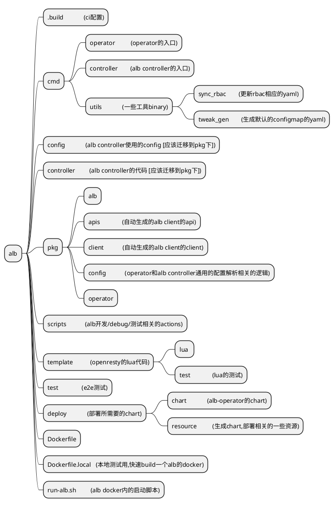
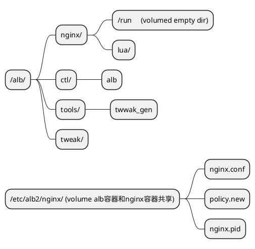

## what it is
ALB (Alauda Load Balancer). a load balancer base on openresty which run in k8s. sometimes we use the same term alb2.
## project struct

## image file struct

## lint 
follow by ./scripts/alb-lint-actions.sh
## git repo 
https://gitlab-ce.alauda.cn/container-platform/alb2