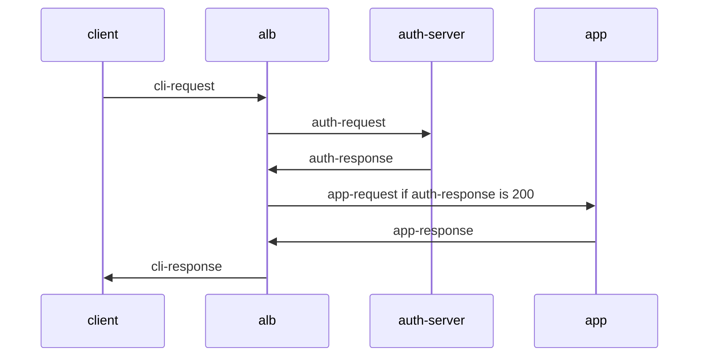
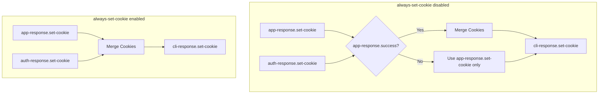
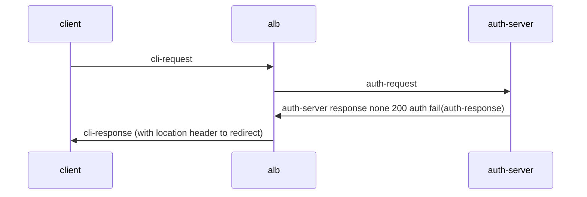
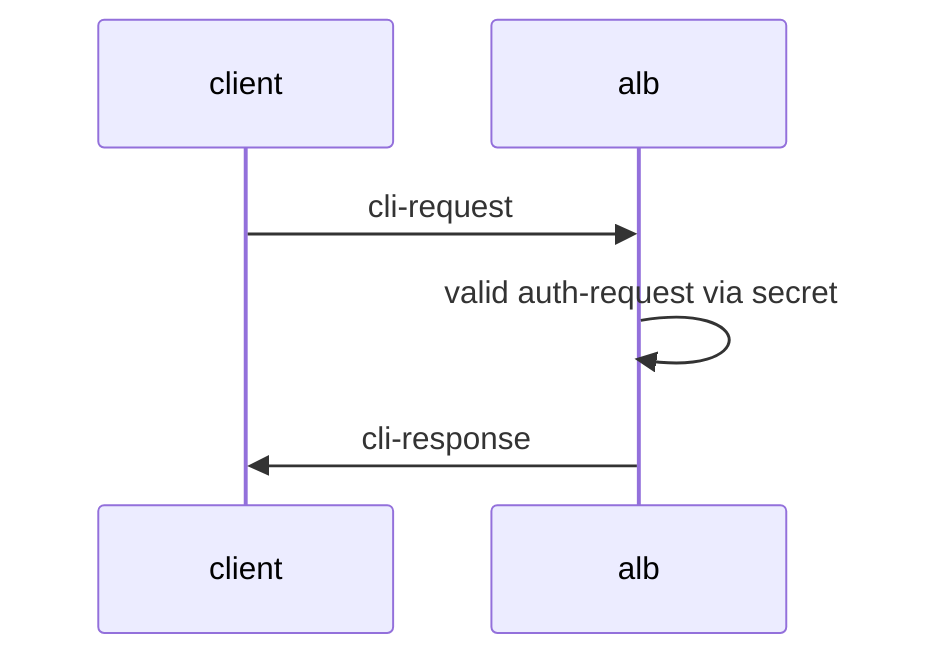

## Basic Concepts
### What is Auth
Auth is a mechanism that performs identity verification before requests reach the actual service. It allows you to handle authentication uniformly at the ALB layer without implementing authentication logic in each backend service.

### Supported Authentication Methods
ALB supports two main authentication methods:

1. **Forward Auth (External Authentication)**
   - Validates user identity by sending requests to an external authentication service
   - Use cases: Complex authentication logic like OAuth, SSO, etc.
   - Workflow:
     1. User request reaches ALB
     2. ALB forwards authentication info to auth service
     3. Auth service returns verification result
     4. Access to backend service is determined based on auth result

2. **Basic Auth (Basic Authentication)**
   - Simple authentication mechanism based on username and password
   - Use cases: Simple access control, development environment protection
   - Workflow:
     1. User request reaches ALB
     2. ALB checks username/password in request
     3. Compares with configured auth credentials
     4. Forwards to backend service after validation

### Authentication Configuration Methods
1. **Global Authentication**
   - Configured at ALB level, applies to all services
   - Configured through ALB2 or FT CR

2. **Path-level Authentication**
   - Configured on specific Ingress paths
   - Configured on specific Rules
   - Can override global auth configuration

3. **Disable Authentication**
   - Can disable auth for specific paths
   - Via ingress annotation: `alb.ingress.cpaas.io/auth-enable: "false"`
   - Via rule CR configuration

### Authentication Result Handling
- Success: Request forwarded to backend service
- Failure: Returns 401 Unauthorized error
- Can configure redirect behavior on auth failure (for Forward Auth)

## Quick Start
Configure basic-auth with ALB

### Deploy ALB
```bash
cat <<EOF | kubectl apply -f -
apiVersion: crd.alauda.io/v2
kind: ALB2
metadata:
  name: auth
  namespace: cpaas-system
spec:
  config:
    networkMode: container
    projects:
    - ALL_ALL
    replicas: 1
    vip: 
      enableLbSvc: false
  type: nginx
EOF
export ALB_IP=$(kubectl get pods -n cpaas-system -l service_name=alb2-auth -o jsonpath='{.items[*].status.podIP}');echo $ALB_IP
```

### Configure Secret and Ingress
```bash
# echo "Zm9vOiRhcHIxJHFJQ05aNjFRJDJpb29pSlZVQU1tcHJxMjU4L0NoUDE=" | base64 -d #  foo:$apr1$qICNZ61Q$2iooiJVUAMmprq258/ChP1
# openssl passwd -apr1 -salt qICNZ61Q bar # $apr1$qICNZ61Q$2iooiJVUAMmprq258/ChP1

kubectl apply -f - <<'END'
apiVersion: v1
kind: Secret
metadata:
  name: auth-file
type: Opaque
data:
  auth: Zm9vOiRhcHIxJHFJQ05aNjFRJDJpb29pSlZVQU1tcHJxMjU4L0NoUDE=
---
apiVersion: networking.k8s.io/v1
kind: Ingress
metadata:
  name: auth-file
  annotations:
    "nginx.ingress.kubernetes.io/auth-type":  "basic"
    "nginx.ingress.kubernetes.io/auth-secret":  "default/auth-file"
    "nginx.ingress.kubernetes.io/auth-secret-type": "auth-file"
spec:
  rules:
  - http:
      paths:
      - path: /app-file
        pathType: Prefix
        backend:
          service:
            name: app-server
            port:
              number: 80
END
```

### Testing
```bash
# echo "Zm9vOiJhYXIi" | base64 -d # foo:bar
curl -v -X GET -H "Authorization: Basic Zm9vOmJhcg=="  http://$ALB_IP:80/app-file # Should return 200
# Wrong password
curl -v -X GET -H "Authorization: Basic XXXXOmJhcg=="  http://$ALB_IP:80/app-file # Should return 401
```

## Ingress Annotation Overview
ingress-nginx defines a series of annotations to configure authentication details. Below is the list of annotations compatible with ALB. v means supported, x means not supported.

|                                                                                                                                                        | support | type                | note                                                                 |
|--------------------------------------------------------------------------------------------------------------------------------------------------------|---------|---------------------|----------------------------------------------------------------------|
| forward-auth                                                                                                                                           |         |                     | Authentication via HTTP request                                       |
| nginx.ingress.kubernetes.io/auth-url                                                                                                                   | v       | string              |                                                                      |
| nginx.ingress.kubernetes.io/auth-method                                                                                                                | v       | string              |                                                                      |
| nginx.ingress.kubernetes.io/auth-signin                                                                                                                | v       | string              |                                                                      |
| nginx.ingress.kubernetes.io/auth-signin-redirect-param                                                                                                 | v       | string              |                                                                      |
| nginx.ingress.kubernetes.io/auth-response-headers                                                                                                      | v       | string              |                                                                      |
| nginx.ingress.kubernetes.io/auth-proxy-set-headers                                                                                                     | v       | string              |                                                                      |
| nginx.ingress.kubernetes.io/auth-request-redirect                                                                                                      | v       | string              |                                                                      |
| nginx.ingress.kubernetes.io/auth-always-set-cookie                                                                                                     | v       | boolean             |                                                                      |
| nginx.ingress.kubernetes.io/auth-snippet                                                                                                               | x       | string              |                                                                      |
| basic-auth                                                                                                                                             |         |                     | Authentication via username/password secret                           |
| nginx.ingress.kubernetes.io/auth-realm                                                                                                                 | v       | string              |                                                                      |
| nginx.ingress.kubernetes.io/auth-secret                                                                                                                | v       | string              |                                                                      |
| nginx.ingress.kubernetes.io/auth-secret-type                                                                                                           | v       | string              |                                                                      |
| nginx.ingress.kubernetes.io/auth-type                                                                                                                  | -       | "basic" or "digest" | basic: supports apr1 algorithm<br>**digest: not supported**           |
| auth-cache                                                                                                                                             |         |                     |                                                                      |
| nginx.ingress.kubernetes.io/auth-cache-key                                                                                                             | x       | string              |                                                                      |
| nginx.ingress.kubernetes.io/auth-cache-duration                                                                                                        | x       | string              |                                                                      |
| auth-keepalive                                                                                                                                         |         |                     | Use keepalive connections for requests. Configure via annotations      |
| nginx.ingress.kubernetes.io/auth-keepalive                                                                                                             | x       | number              |                                                                      |
| nginx.ingress.kubernetes.io/auth-keepalive-share-vars                                                                                                  | x       | "true" or "false"   |                                                                      |
| nginx.ingress.kubernetes.io/auth-keepalive-requests                                                                                                    | x       | number              |                                                                      |
| nginx.ingress.kubernetes.io/auth-keepalive-timeout                                                                                                     | x       | number              |                                                                      |
| [auth-tls](https://github.com/kubernetes/ingress-nginx/blob/main/docs/user-guide/nginx-configuration/annotations.md#client-certificate-authentication) |         |                     | Additional certificate validation for HTTPS requests                   |
| nginx.ingress.kubernetes.io/auth-tls-secret                                                                                                            | x       | string              |                                                                      |
| nginx.ingress.kubernetes.io/auth-tls-verify-depth                                                                                                      | x       | number              |                                                                      |
| nginx.ingress.kubernetes.io/auth-tls-verify-client                                                                                                     | x       | string              |                                                                      |
| nginx.ingress.kubernetes.io/auth-tls-error-page                                                                                                        | x       | string              |                                                                      |
| nginx.ingress.kubernetes.io/auth-tls-pass-certificate-to-upstream                                                                                      | x       | "true" or "false"   |                                                                      |
| nginx.ingress.kubernetes.io/auth-tls-match-cn                                                                                                          | x       | string              |                                                                      |

## Forward Auth



Related annotations:
- nginx.ingress.kubernetes.io/auth-url
- nginx.ingress.kubernetes.io/auth-method  
- nginx.ingress.kubernetes.io/auth-signin
- nginx.ingress.kubernetes.io/auth-signin-redirect-param
- nginx.ingress.kubernetes.io/auth-response-headers
- nginx.ingress.kubernetes.io/auth-proxy-set-headers
- nginx.ingress.kubernetes.io/auth-request-redirect
- nginx.ingress.kubernetes.io/auth-always-set-cookie

These annotations describe modifications to auth-request, app-request, and cli-response in the flow diagram above.

### Auth Request Related Annotations
#### auth-url
URL for auth-request, value can be variables.

#### auth-method
Method for auth-request.

#### auth-proxy-set-headers
Value is a configmap reference in format `ns/name`.
By default, all cli-request headers are sent to auth-server. Additional headers can be configured via proxy_set_header. Default additional headers:
```
X-Original-URI          $request_uri;
X-Scheme                $pass_access_scheme;
X-Original-URL          $scheme://$http_host$request_uri;
X-Original-Method       $request_method;
X-Sent-From             "alb";
X-Real-IP               $remote_addr;
X-Forwarded-For         $proxy_add_x_forwarded_for;
X-Auth-Request-Redirect $request_uri;	
```

### App Request Related Annotations
#### auth-response-headers
Value is a comma-separated string allowing specific auth-response headers in app-request.
Example:
```
nginx.ingress.kubernetes.io/auth-response-headers: Remote-User,Remote-Name
```
When ALB sends request to app (app-request), it will include Remote-User and Remote-Name from auth-response headers.

### Cookie Handling
Both auth-response and app-response can set cookies. By default, auth-response.set-cookie is merged into cli-response.set-cookie only when app-response.success.


### Sign Redirect Related Configuration
When auth-server returns 401, we can redirect browser to auth-signin URL via redirect header in cli-response


#### auth-signin
Value is URL specifying location header in cli-response.

#### auth-signin-redirect-param
Query parameter name in signin-url, default is rd.
If auth-signin URL doesn't contain parameter specified by `auth-signin-redirect-param`, system automatically adds it. Parameter value is set to `$pass_access_scheme://$http_host$escaped_request_uri` to record original request URL.

#### auth-request-redirect
Sets `x-auth-request-redirect` header in auth-request

## Basic Auth
Basic auth refers to authentication process described in [RFC 7617](https://datatracker.ietf.org/doc/html/rfc7617).
Interaction flow:


### auth-realm
[String describing protected area](https://developer.mozilla.org/zh-CN/docs/Web/HTTP/Headers/WWW-Authenticate#realm)
Realm value in `WWW-Authenticate` header of cli-response
WWW-Authenticate: Basic realm="$realm"

### auth-type
Authentication scheme type, currently only supports basic

### auth-secret
Secret reference containing username/password config, format is ns/name

### auth-secret-type
Two supported secret formats:
1. auth-file: secret data contains single "auth" key with Apache htpasswd format string value. Example:
   ```
   data:
     auth: "user1:$apr1$xyz..."
   ```

2. auth-map: each key in secret data represents username, corresponding value is password hash (htpasswd format without username). Example:
   ```
   data:
     user1: "$apr1$xyz...."
     user2: "$apr1$abc...."
   ```

Note: Currently only supports htpasswd format password hashes generated with apr1 algorithm.

## New ALB CR Configuration Items
ALB CR adds auth-related configuration items configurable in alb2/ft/rule CRs.
During runtime, ALB converts ingress annotations to rules
```yaml
auth:
  # Basic auth config
  basic:
    #  string; corresponds to nginx.ingress.kubernetes.io/auth-type: basic
    auth_type: "basic"
    #  string; corresponds to nginx.ingress.kubernetes.io/auth-realm
    realm: "Restricted Access"  
    #  string; corresponds to nginx.ingress.kubernetes.io/auth-secret
    secret: "ns/name"
    #  string; corresponds to nginx.ingress.kubernetes.io/auth-secret-type
    secret_type: "auth-map|auth-file"
  # Forward auth config
  forward:
    #  boolean; corresponds to nginx.ingress.kubernetes.io/auth-always-set-cookie
    always_set_cookie: true
    #  string; corresponds to nginx.ingress.kubernetes.io/auth-proxy-set-headers
    auth_headers_cm_ref: "ns/name"
    #  string; corresponds to nginx.ingress.kubernetes.io/auth-request-redirect
    auth_request_redirect: "/login"
    # corresponds to nginx.ingress.kubernetes.io/auth-method
    method: "GET"
    # corresponds to nginx.ingress.kubernetes.io/auth-signin
    signin: "/signin"
    # corresponds to nginx.ingress.kubernetes.io/auth-signin-redirect-param
    signin_redirect_param: "redirect_to"
    # corresponds to nginx.ingress.kubernetes.io/auth-response-headers
    upstream_headers:
      - "X-User-ID" 
      - "X-User-Name"
      - "X-User-Email"
    # corresponds to nginx.ingress.kubernetes.io/auth-url
    url: "http://auth-service/validate"
```
Auth can be configured in:
- Alb CR's `.spec.config.auth`
- Frontend CR's `.spec.config.auth`
- Rule CR's `.spec.config.auth`

Inheritance order is Alb>Frontend>Rule. If child CR has no configuration, it uses parent CR's configuration.

## ALB Special Ingress Annotations
When processing ingress, ALB decides priority based on annotation prefix
Priority from high to low:
- `index.$rule_index-$path_index.alb.ingress.cpaas.io`
- `alb.ingress.cpaas.io`
- `nginx.ingress.kubernetes.io`
This handles compatibility with ingress-nginx and specifies auth config for specific ingress paths

### auth-enable
```yaml
alb.ingress.cpaas.io/auth-enable: "false"
```
New ALB annotation specifying whether to enable auth for ingress.

## Other ingress-nginx Auth Features
### global-auth
In ingress-nginx, global auth can be set via configmap, equivalent to configuring auth for all ingresses
In ALB, auth can be configured on alb2 and ft CRs. Rules under them inherit these configurations

### no-auth-locations
In ALB, auth can be disabled for an ingress via annotation: `alb.ingress.cpaas.io/auth-enable: "false"`

## Note: Incompatibilities with ingress-nginx
1. No auth-keepalive support
2. No auth-snippet support
3. No auth-cache support
4. No auth-tls support
5. Basic-auth only supports basic, not digest
6. Basic-auth basic only supports apr1 algorithm, not bcrypt sha256 etc.

## Troubleshooting
1. Check ALB pod nginx container logs
2. Check X-ALB-ERR-REASON header in response

## Other Resources
[ALB with oauth-proxy](./配置oauth2-proxy.md)
[Test Cases](./测试用例.md)
[ALB Auth Implementation Details](./dev_readme.md)
[ingress-nginx Annotations Details](https://github.com/kubernetes/ingress-nginx/blob/main/docs/user-guide/nginx-configuration/annotations.md#authentication)