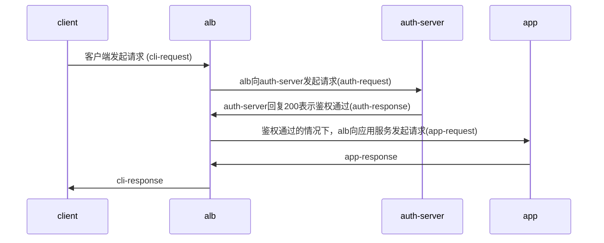
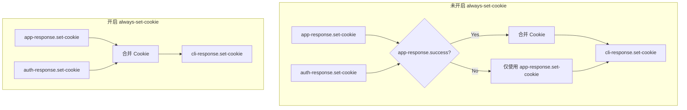
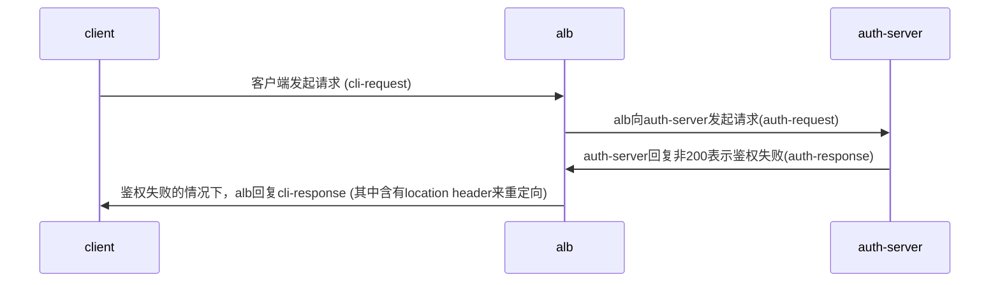
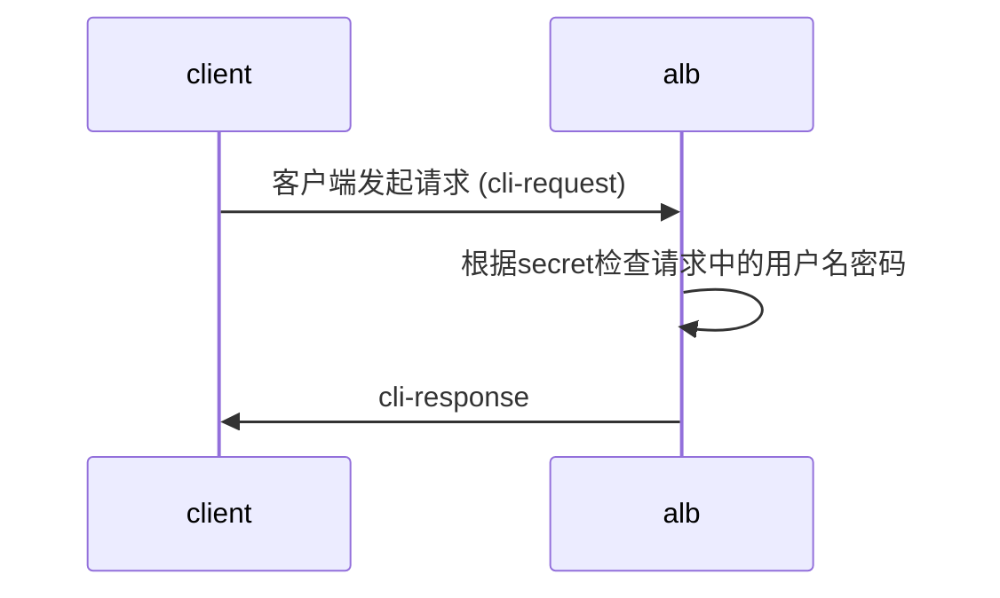

the english version: [auth-eng](./auth-eng.md)
## 基础概念
### 什么是 Auth
Auth是一个在请求到达实际服务之前进行身份验证的机制。它允许您在 ALB 层面统一处理认证，而不需要在每个后端服务中实现认证逻辑。

### 支持的认证方式
ALB 支持两种主要的认证方式：

1. **Forward Auth（外部认证）**
   - 通过发送请求到外部认证服务来验证用户身份
   - 适用场景：需要复杂认证逻辑，如 OAuth、SSO 等
   - 工作流程：
     1. 用户请求到达 ALB
     2. ALB 将认证信息转发给认证服务
     3. 认证服务返回验证结果
     4. 根据认证结果决定是否允许访问后端服务

2. **Basic Auth（基础认证）**
   - 基于用户名和密码的简单认证机制
   - 适用场景：简单的访问控制，开发环境保护
   - 工作流程：
     1. 用户请求到达 ALB
     2. ALB 检查请求中的用户名密码
     3. 与配置的认证信息比对
     4. 验证通过后转发到后端服务

### 认证配置方式
1. **全局认证**
   - 在 ALB 级别配置，适用于所有服务
   - 通过 ALB2 或 FT 的 CR 进行配置

2. **路径级认证**
   - 在具体的 Ingress 路径上配置
   - 在具体的 Rule 上配置
   - 可以覆盖全局认证配置

3. **禁用认证**
   - 可以针对特定路径禁用认证
   - 在ingress 上 通过 annotation 配置：`alb.ingress.cpaas.io/auth-enable: "false"`
   - 在rule上通过CR配置.

### 认证结果处理
- 认证成功：请求将被转发到后端服务
- 认证失败：返回 401 未授权错误
- 可以配置认证失败后的重定向行为（适用于 Forward Auth）
## 快速开始
通过alb 配置basic-auth

### 部署alb
```bash
cat <<EOF | kubectl apply -f -
apiVersion: crd.alauda.io/v2
kind: ALB2
metadata:
  name: auth
  namespace: cpaas-system
spec:
  config:
    networkMode: container
    projects:
    - ALL_ALL
    replicas: 1
    vip: 
      enableLbSvc: false
  type: nginx
EOF
export ALB_IP=$(kubectl get pods -n cpaas-system -l service_name=alb2-auth -o jsonpath='{.items[*].status.podIP}');echo $ALB_IP
```
### 配置secret和ingress
```bash
# echo "Zm9vOiRhcHIxJHFJQ05aNjFRJDJpb29pSlZVQU1tcHJxMjU4L0NoUDE=" | base64 -d #  foo:$apr1$qICNZ61Q$2iooiJVUAMmprq258/ChP1
# openssl passwd -apr1 -salt qICNZ61Q bar # $apr1$qICNZ61Q$2iooiJVUAMmprq258/ChP1

kubectl apply -f - <<'END'
apiVersion: v1
kind: Secret
metadata:
  name: auth-file
type: Opaque
data:
  auth: Zm9vOiRhcHIxJHFJQ05aNjFRJDJpb29pSlZVQU1tcHJxMjU4L0NoUDE=
---
apiVersion: networking.k8s.io/v1
kind: Ingress
metadata:
  name: auth-file
  annotations:
    "nginx.ingress.kubernetes.io/auth-type":  "basic"
    "nginx.ingress.kubernetes.io/auth-secret":  "default/auth-file"
    "nginx.ingress.kubernetes.io/auth-secret-type": "auth-file"
spec:
  rules:
  - http:
      paths:
      - path: /app-file
        pathType: Prefix
        backend:
          service:
            name: app-server
            port:
              number: 80
END
```
### 测试
```bash
# echo "Zm9vOiJhYXIi" | base64 -d # foo:bar
curl -v -X GET -H "Authorization: Basic Zm9vOmJhcg=="  http://$ALB_IP:80/app-file # 应返回200
# 错误密码
curl -v -X GET -H "Authorization: Basic XXXXOmJhcg=="  http://$ALB_IP:80/app-file # 应返回401
```

## ingress annotation 全览
ingress-nginx定义了一系列的annotation来配置认证过程中的具体细节,下面是alb兼容的annotation列表. v 表示支持, x 表示不支持.

|                                                                                                                                                        | support | type                | note                                                                 |
|--------------------------------------------------------------------------------------------------------------------------------------------------------|---------|---------------------|----------------------------------------------------------------------|
| forward-auth                                                                                                                                           |         |                     | 通过发http请求完成鉴权                                               |
| nginx.ingress.kubernetes.io/auth-url                                                                                                                   | v       | string              |                                                                      |
| nginx.ingress.kubernetes.io/auth-method                                                                                                                | v       | string              |                                                                      |
| nginx.ingress.kubernetes.io/auth-signin                                                                                                                | v       | string              |                                                                      |
| nginx.ingress.kubernetes.io/auth-signin-redirect-param                                                                                                 | v       | string              |                                                                      |
| nginx.ingress.kubernetes.io/auth-response-headers                                                                                                      | v       | string              |                                                                      |
| nginx.ingress.kubernetes.io/auth-proxy-set-headers                                                                                                     | v       | string              |                                                                      |
| nginx.ingress.kubernetes.io/auth-request-redirect                                                                                                      | v       | string              |                                                                      |
| nginx.ingress.kubernetes.io/auth-always-set-cookie                                                                                                     | v       | boolean             |                                                                      |
| nginx.ingress.kubernetes.io/auth-snippet                                                                                                               | x       | string              |                                                                      |
| basic-auth                                                                                                                                             |         |                     | 通过指定用户名密码secret完成鉴权                                     |
| nginx.ingress.kubernetes.io/auth-realm                                                                                                                 | v       | string              |                                                                      |
| nginx.ingress.kubernetes.io/auth-secret                                                                                                                | v       | string              |                                                                      |
| nginx.ingress.kubernetes.io/auth-secret-type                                                                                                           | v       | string              |                                                                      |
| nginx.ingress.kubernetes.io/auth-type                                                                                                                  | -       | "basic" or "digest" | basic:加密算法支持apr1<br>**digest: 不支持**                         |
| auth-cache                                                                                                                                             |         |                     |                                                                      |
| nginx.ingress.kubernetes.io/auth-cache-key                                                                                                             | x       | string              |                                                                      |
| nginx.ingress.kubernetes.io/auth-cache-duration                                                                                                        | x       | string              |                                                                      |
| auth-keepalive                                                                                                                                         |         |                     | 发请求时，使用keepalive长连接。通过一系列annotation指定keepalive的行为 |
| nginx.ingress.kubernetes.io/auth-keepalive                                                                                                             | x       | number              |                                                                      |
| nginx.ingress.kubernetes.io/auth-keepalive-share-vars                                                                                                  | x       | "true" or "false"   |                                                                      |
| nginx.ingress.kubernetes.io/auth-keepalive-requests                                                                                                    | x       | number              |                                                                      |
| nginx.ingress.kubernetes.io/auth-keepalive-timeout                                                                                                     | x       | number              |                                                                      |
| [auth-tls](https://github.com/kubernetes/ingress-nginx/blob/main/docs/user-guide/nginx-configuration/annotations.md#client-certificate-authentication) |         |                     | 当请求是https时，额外校验请求发过来的证书.                            |
| nginx.ingress.kubernetes.io/auth-tls-secret                                                                                                            | x       | string              |                                                                      |
| nginx.ingress.kubernetes.io/auth-tls-verify-depth                                                                                                      | x       | number              |                                                                      |
| nginx.ingress.kubernetes.io/auth-tls-verify-client                                                                                                     | x       | string              |                                                                      |
| nginx.ingress.kubernetes.io/auth-tls-error-page                                                                                                        | x       | string              |                                                                      |
| nginx.ingress.kubernetes.io/auth-tls-pass-certificate-to-upstream                                                                                      | x       | "true" or "false"   |                                                                      |
| nginx.ingress.kubernetes.io/auth-tls-match-cn                                                                                                          | x       | string              |                                                                      |
## forward-auth




涉及到的annotation
- nginx.ingress.kubernetes.io/auth-url
- nginx.ingress.kubernetes.io/auth-method
- nginx.ingress.kubernetes.io/auth-signin
- nginx.ingress.kubernetes.io/auth-signin-redirect-param
- nginx.ingress.kubernetes.io/auth-response-headers
- nginx.ingress.kubernetes.io/auth-proxy-set-headers
- nginx.ingress.kubernetes.io/auth-request-redirect
- nginx.ingress.kubernetes.io/auth-always-set-cookie

这些annotation就是在描述上图流程中，对auth-request，和app-request，cli-response所做的修改。
### 构造 auth-request 相关的annotation
#### auth-url
auth-request的url,value可以是变量.  
#### auth-method
auth-request的method.  
#### auth-proxy-set-headers
value是一个configmap的refs,格式为`ns/name`.
默认会将cli-request的所有header都发送给auth-server。可以通过 proxy_set_header 来配置额外的header，默认会额外发送以下header：
```
X-Original-URI          $request_uri;
X-Scheme                $pass_access_scheme;
X-Original-URL          $scheme://$http_host$request_uri;
X-Original-Method       $request_method;
X-Sent-From             "alb";
X-Real-IP               $remote_addr;
X-Forwarded-For         $proxy_add_x_forwarded_for;
X-Auth-Request-Redirect $request_uri;	
```
### 构造 app-request 相关的annotation
#### auth-response-headers
value是一个由逗号分隔的字符串，让我们可以在app-request中带上特定的的来自auth-response的header。
示例
```
nginx.ingress.kubernetes.io/auth-response-headers: Remote-User,Remote-Name
```
在alb向app发起请求时(app-request),会带上auth-response header中的Remote-User和Remote-Name.

### cookie 处理
auth-response和app-response都可以设置cookie.默认情况下只有在app-response.success时，才会将auth-response.set-cookie合并到cli-response.set-cookie中.


### 重定向 sign 相关配置
当auth-server返回401时，我们可以通过在cli-response中设置redirect header来指示浏览器重定向到auth-signin指定的url进行鉴权验证

#### auth-signin
value是个url，指定cli-response中的location header。
#### auth-signin-redirect-param
signin-url中查询参数的名称，默认是rd.
如果auth-signin的URL中没有包含`auth-signin-redirect-param`指定的参数名称，系统会自动添加该参数。参数值会被设置为`$pass_access_scheme://$http_host$escaped_request_uri`，用于记录原始请求的URL。
#### auth-request-redirect
设置auth-request中的`x-auth-request-redirect` header

## basic-auth
basic-auth 指的是[RFC 7617](https://datatracker.ietf.org/doc/html/rfc7617)所描述的鉴权过程。
交互流程如下


### auth-realm
[描述受保护区域的字符串](https://developer.mozilla.org/zh-CN/docs/Web/HTTP/Headers/WWW-Authenticate#realm)
即cli-response中的`WWW-Authenticate` header中的realm值
WWW-Authenticate: Basic realm="$realm"
### auth-type
身份验证方案的类型，目前只支持basic
### auth-secret
用户名密码配置所在的secret refs，格式为ns/name
### auth-secret-type
secret的格式支持两种类型：
1. auth-file: secret的data中只包含一个key为"auth"的字段，其value是Apache htpasswd格式的字符串。例如:
   ```
   data:
     auth: "user1:$apr1$xyz..."
   ```

2. auth-map: secret的data中每个key代表一个用户名，对应的value是该用户的密码哈希(不含用户名的htpasswd格式)。例如:
   ```
   data:
     user1: "$apr1$xyz...."
     user2: "$apr1$abc...."
   ```

注意: 目前仅支持使用apr1算法生成的htpasswd格式密码哈希。

## alb cr 新增配置项
alb cr 新增了auth相关的配置项，可以配置在alb2/ft/rule的cr上。
在实际运行时,alb会将ingress上的annotation转换为rule
```yaml
auth:
  # Basic 认证配置
  basic:
    #  string; 对应 nginx.ingress.kubernetes.io/auth-type: basic
    auth_type: "basic"
    #  string; 对应 nginx.ingress.kubernetes.io/auth-realm
    realm: "Restricted Access"  
    #  string; 对应 nginx.ingress.kubernetes.io/auth-secret
    secret: "ns/name"
    #  string; 对应 nginx.ingress.kubernetes.io/auth-secret-type
    secret_type: "auth-map|auth-file"
  # Forward 认证配置
  forward:
    #  boolean; 对应 nginx.ingress.kubernetes.io/auth-always-set-cookie
    always_set_cookie: true
    #  string; 对应 nginx.ingress.kubernetes.io/auth-proxy-set-headers
    auth_headers_cm_ref: "ns/name"
    #  string; 对应 nginx.ingress.kubernetes.io/auth-request-redirect
    auth_request_redirect: "/login"
    # 对应 nginx.ingress.kubernetes.io/auth-method
    method: "GET"
    # 对应 nginx.ingress.kubernetes.io/auth-signin
    signin: "/signin"
    # 对应 nginx.ingress.kubernetes.io/auth-signin-redirect-param
    signin_redirect_param: "redirect_to"
    # 对应 nginx.ingress.kubernetes.io/auth-response-headers
    upstream_headers:
      - "X-User-ID" 
      - "X-User-Name"
      - "X-User-Email"
    # 对应 nginx.ingress.kubernetes.io/auth-url
    url: "http://auth-service/validate"
```
auth支持配置在
- Alb Cr的`.spec.config.auth`
- Frontend Cr的`.spec.config.auth`
- Rule Cr的`.spec.config.auth`

继承顺序为Alb>Frontend>Rule.如果子cr没有配置，则使用父cr的配置.

## alb special ingress annotation
alb在处理ingress时,按照annotation的前缀来决定优先级
优先级从高到低为
- `index.$rule_index-$path_index.alb.ingress.cpaas.io`
- `alb.ingress.cpaas.io`
- `nginx.ingress.kubernetes.io`
这样可以处理和ingress-nginx的兼容性问题,和指定ingress某个路径上auth配置
### auth-enable
```yaml
alb.ingress.cpaas.io/auth-enable: "false"
```
alb新增的annotation,用于指定ingress是否开启auth功能.

## ingress-nginx auth相关其他特性
### global-auth
在ingress-nginx中可以通过configmap设置一个全局的auth。相当给所有的ingress配置了auth
在alb中可以在alb2和ft的cr上配置auth。其下的rule会继承这些配置
### no-auth-locations
在alb中可以通过在ingress上配置 annotation: `alb.ingress.cpaas.io/auth-enable: "false"` 的方式关闭这个ingress的auth功能。

## 注意: 与ingress-nginx 不兼容的部分
1. 不支持auth-keepalive
2. 不支持 auth-snippet
3. 不支持 auth-cache
4. 不支持 auth-tls
5. basic-auth 只支持basic 不支持digest
6. basic-auth basic 只支持apr1算法，不支持bcrypt sha256等
## 故障排查
1. 检查alb pod nginx 容器日志
2. 检查返回中的X-ALB-ERR-REASON header
## 其他
[alb 配合 oauth-proxy](./配置oauth2-proxy.md)  
[测试用例](./测试用例.md)  
[alb auth 实现说明](./dev_readme.md)  
[ingress-nginx auth 实现说明](https://github.com/kubernetes/ingress-nginx/blob/main/docs/user-guide/nginx-configuration/annotations.md#authentication)  