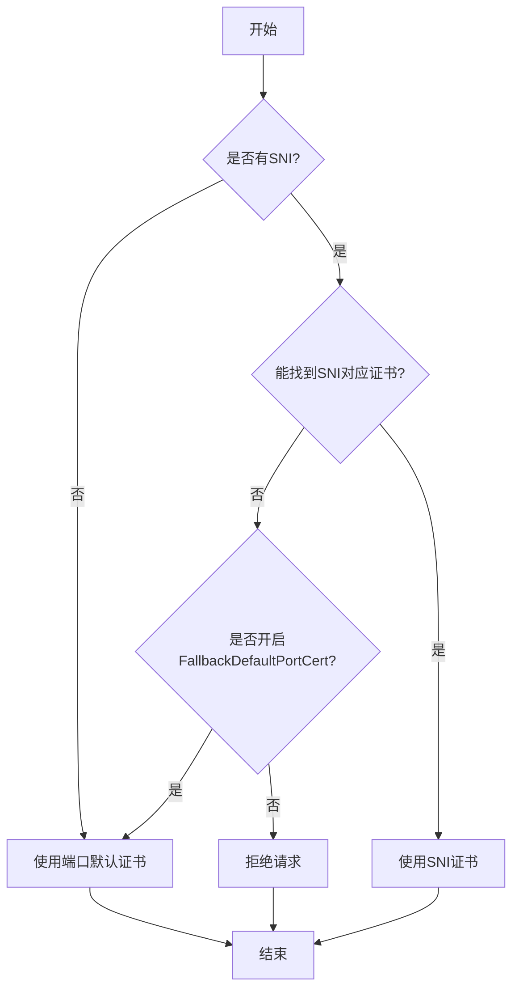

fallback端口默认证书
## 前情提要
当配置了端口默认证书时，用户可能是期望配置一个兜底的证书。让https请求能够正常的走到匹配规则的逻辑上来。

但是当有域名，而"特意"没有配置证书时，此时的期望可能是在https握手的阶段通过不返回证书的方式拒绝掉这个请求。这和默认证书的期望不一致。

fallback端口默认证书这个开关新增一个全局的配置项FallbackDefaultPortCert。来控制这一行为。

查找证书的逻辑如下图

FallbackDefaultPortCert 默认关闭。可以通过在alb上配置`alb.cpaas.io/nginx-env:'{"FallbackDefaultPortCert":"true"}'`来开启。
## 版本
| 版本       | FallbackDefaultPortCert默认值 | 是否支持annotation配置 |
|------------|-------------------------------|-----------------------|
| (,3.16)    | false                         | 否                     |
| [3.16,4.0) | true                          | 否                     |
| [4.0,)     | false                         | 是                     |

## 测试case
1. 部署alb,配置ft默认证书
```bash
kubectl create ns cert
kubectl label ns --overwrite cert cpaas.io/project=cert
openssl req -x509 -newkey rsa:4096 -sha256 -days 3650 -nodes  -keyout ./key -out ./cert -subj  /CN="test.com"
openssl rsa -in ./key -traditional -out ./key-rsa
kubectl delete secret cert-tls -n cert || true
kubectl create secret tls cert-tls -n cert --key=./key-rsa --cert=./cert

# common-app.yaml 在/docs/_res目录下
kubectl apply -f ./common-app.yaml -n cert 
# 注意alb的443端口配置了默认证书 
cat <<EOF | kubectl apply -f -
apiVersion: crd.alauda.io/v2
kind: ALB2
metadata:
    name: cert-alb
    namespace: cpaas-system
spec:
    type: "nginx" 
    config:
        networkMode: container
        loadbalancerName: cert-alb
        projects:
        - cert
        replicas: 1
        vip:
            enableLbSvc: false
---
apiVersion: crd.alauda.io/v1
kind: Frontend
metadata:
  labels:
    alb2.cpaas.io/name: cert-alb
  name: cert-alb-00080
  namespace: cpaas-system
spec:
  port: 80
  protocol: http
---
apiVersion: crd.alauda.io/v1
kind: Frontend
metadata:
  labels:
    alb2.cpaas.io/name: cert-alb
  name: cert-alb-000443
  namespace: cpaas-system
spec:
  port: 443
  certificate_name: cert/cert-tls
  protocol: https
EOF
```

2. 部署ingress

```bash
# ingress的a.com配置了证书，b.com没有配置证书
cat <<EOF | kubectl apply -f -
apiVersion: networking.k8s.io/v1
kind: Ingress
metadata:
    name: cert-ingress
    namespace: cert
spec:
  tls:
  - hosts:
    - a.com
    secretName: cert-tls
  rules:
  - host: a.com
    http:
      paths:
      - path: /
        pathType: Prefix
        backend:
          service:
            name: echo-resty
            port:
              number: 80
  - host: b.com
    http:
      paths:
      - path: /
        pathType: Prefix
        backend:
          service:
            name: echo-resty
            port:
              number: 80
EOF
```
3 测试
```bash
export ALB_IP=$(kubectl get pods -n cpaas-system -l service_name=alb2-cert-alb -o jsonpath='{.items[*].status.podIP}');echo $ALB_IP
# 访问https有证书的 应该返回200
curl -svk --resolve a.com:443:$ALB_IP  https://a.com:443/

# 访问https无证书的 应该报错
curl -svk --resolve b.com:443:$ALB_IP  https://b.com:443/

# 没有sni的请求，应该使用端口默认证书，返回404
curl -svk   https://$ALB_IP:443/

# 开启fallback 
kubectl annotate alb2 cert-alb alb.cpaas.io/nginx-env='{"FallbackDefaultPortCert":"true"}' -n cpaas-system
# alb会重启，等待重启完成
export ALB_IP=$(kubectl get pods -n cpaas-system -l service_name=alb2-cert-alb -o jsonpath='{.items[*].status.podIP}');echo $ALB_IP
# 访问https有证书的 应该返回200
curl -svk --resolve a.com:443:$ALB_IP  https://a.com:443/

# (这里不同了) 访问https无证书的 应该返回200
curl -svk --resolve b.com:443:$ALB_IP  https://b.com:443/

# 没有sni的请求，应该使用端口默认证书，返回404
curl -svk   https://$ALB_IP:443/
```
## 清理
```bash
kubectl delete -f ./common-app.yaml -n cert
kubectl delete ingress cert-ingress -n cert
kubectl delete secret cert-tls -n cert
kubectl delete alb2 cert-alb -n cpaas-system
```